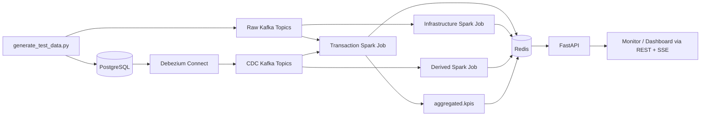
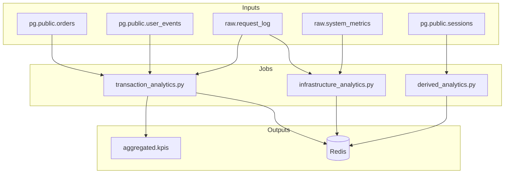
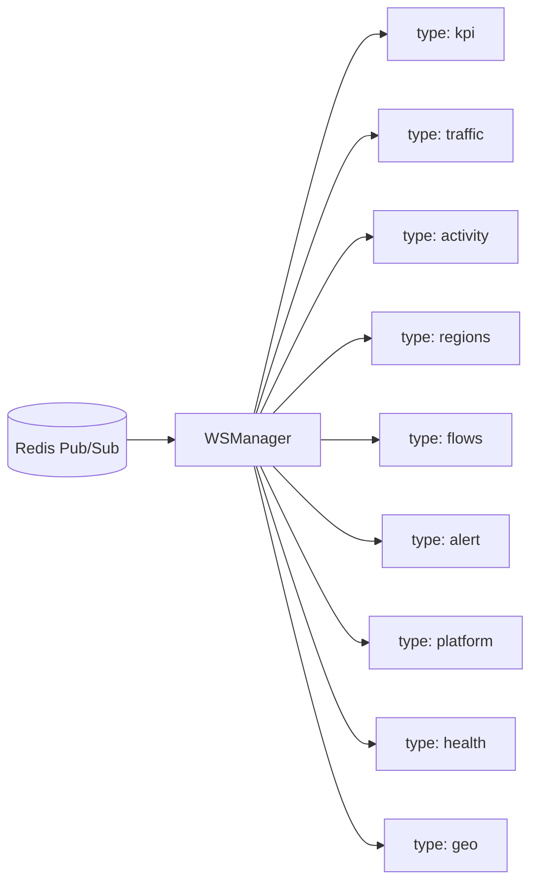
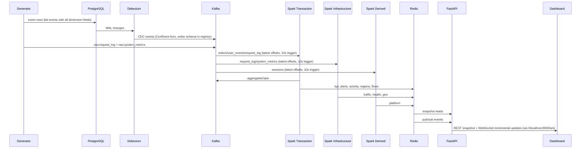

# Nexus Streaming Flow

This document describes the current streaming path implemented in this repository, from source generation and PostgreSQL CDC through Kafka, Spark jobs, Redis, and the FastAPI layer used by the dashboard and the test monitor.

It is intentionally operational:
- what emits data
- what each Spark job reads
- what each job writes
- which Redis keys and API endpoints are fed by each stage

## End-to-End Overview



## Source Layer

### Synthetic Generator

[`scripts/generate_test_data.py`](/home/anouar_zerrik1/projects/cdc-pipeline-feature-debezium-mode-worktree/scripts/generate_test_data.py) drives both ingestion paths:

- PostgreSQL writes (fat-event rows — all display/dimension fields embedded at write time):
  - `orders` — includes `user_display_name`, `region_name`, `platform`, `city`, `country_code`, `amount`
  - `sessions` — includes `platform`, `user_display_name`
  - `user_events` — includes `user_display_name`, `platform`, `city`, `country_code`, `amount`
  - other relational source tables already present in the schema
- direct Kafka writes (Avro with inline schema):
  - `raw.request_log`
  - `raw.system_metrics`

`mode=all` runs the Postgres and Kafka generation paths concurrently.

### Fat-Event Denormalization

All dimension data (`user_display_name`, `region_name`, `platform`, `city`, `country_code`, `amount`) is embedded directly into source rows at write time by the generator. There are **no per-batch JDBC reads** in any Spark hot path. This eliminates cross-stream joins on CDC data and removes latency spikes that would otherwise occur when a batch performs JDBC lookups while concurrently processing streaming windows.

### PostgreSQL and Debezium

Transactional and behavioral tables live in PostgreSQL. Debezium captures row changes and publishes them to Kafka CDC topics in Confluent Avro format (5-byte Schema Registry wire header + Avro payload). Each CDC topic value is registered under `<topic>-value` in the Schema Registry.


Primary CDC topics used by the streaming jobs:

- `pg.public.orders`
- `pg.public.sessions`
- `pg.public.user_events`
- `pg.public.products`
- `pg.public.users`

## Kafka Layer

There are two input classes:

- Direct raw topics (Avro with inline schema, `startingOffsets=latest`):
  - `raw.request_log`
  - `raw.system_metrics`
- Debezium CDC topics (Confluent Avro, writer schema fetched from registry, `startingOffsets=latest`):
  - `pg.public.*`

There is also one derived Kafka topic currently used as a contract output:

- `aggregated.kpis`

### Avro Decoding

[`src/streaming/kafka_sources.py`](/home/anouar_zerrik1/projects/cdc-pipeline-feature-debezium-mode-worktree/src/streaming/kafka_sources.py) handles two concerns:

1. **Schema Registry wire header**: Confluent Avro payloads carry a 5-byte header (magic byte + 4-byte schema ID). This is stripped via `substring(value, 6, length(value) - 5)` before passing the payload to `from_avro`.

2. **Writer schema fetch**: At startup, `_fetch_schema_from_registry` fetches the latest schema from Schema Registry using `urllib.request` (the `requests` library is not available in the Spark Docker image). The writer schema is used directly, avoiding name/namespace mismatches that cause `from_avro` in PERMISSIVE mode to silently return NULL for every record.

### Watermark Placement

`read_cdc_stream` and `read_direct_stream` do **not** call `.withWatermark()`. Watermarks are applied inside each aggregator transform after unioning multiple streams, because Spark 3.3+ raises `AnalysisException: Redefining watermark is disallowed` if `.withWatermark()` is called on the same logical plan node more than once.

### Checkpoints

Checkpoints are stored in `/tmp/nexus-checkpoints` (ephemeral). They are lost when containers restart, so all streams resume from `startingOffsets=latest` on each startup. This is intentional — starting from `earliest` on restart caused the first batch to drain 1000–1500 messages on a single executor core, reliably triggering `ProcessingTimeExecutor: Current batch is falling behind`.

## Spark Cluster

Two Spark workers are registered with the standalone master at `spark://spark-master:7077`:

| Container | Cores | Memory | Web UI (host) |
|---|---|---|---|
| `nexus-spark-worker` | auto-detected (~10) | auto-detected (~14.6 GiB) | http://localhost:8091 |
| `nexus-spark-worker-2` | auto-detected (~10) | auto-detected (~14.6 GiB) | http://localhost:8092 |

Each of the three Spark job containers submits to the cluster with `--total-executor-cores 6` and a 10-second trigger interval. Trigger intervals are defined in [`src/streaming/config.py`](/home/anouar_zerrik1/projects/cdc-pipeline-feature-debezium-mode-worktree/src/streaming/config.py):

```
TRIGGER_TRANSACTIONS    = "10 seconds"
TRIGGER_INFRASTRUCTURE  = "10 seconds"
TRIGGER_DERIVED         = "10 seconds"
```

Each job's Spark Driver UI is accessible at:

| Job | Driver UI |
|---|---|
| `nexus-transactions` | http://localhost:4040 |
| `nexus-infrastructure` | http://localhost:4041 |
| `nexus-derived` | http://localhost:4042 |

## Spark Jobs

There are three Spark applications in the stack.



### 1. Transaction Job

Entry point:
- [`src/streaming/jobs/transaction_analytics.py`](/home/anouar_zerrik1/projects/cdc-pipeline-feature-debezium-mode-worktree/src/streaming/jobs/transaction_analytics.py)

Purpose:
- business KPIs
- alert state
- live activity feed
- regional snapshot
- flow snapshot

Each aggregator receives its own independent stream instance (separate `read_orders(spark)` / `read_request_log(spark)` calls per consumer) to avoid Spark seeing multiple streaming queries redefining watermark on the same logical plan node.

Inputs:
- `orders` CDC stream — two independent instances (`orders_kpi` for KPI aggregator, `orders_region` for region aggregator)
- `user_events` CDC stream — activity enricher
- `request_log` direct Kafka stream — two independent instances (`request_log_kpi`, `request_log_region`)
- `products` CDC stream — KPI aggregator

Main transforms:

#### KPI Aggregator

File:
- [`src/streaming/transforms/kpi_aggregator.py`](/home/anouar_zerrik1/projects/cdc-pipeline-feature-debezium-mode-worktree/src/streaming/transforms/kpi_aggregator.py)

Reads:
- completed orders (revenue, order count — `amount` field from fat-event row)
- active sessions (active user count)
- request logs (error rate, latency)

Computes:
- `activeUsers`
- `revenue`
- `orders`
- `errorRate`
- `latency`
- trend fields using hourly Redis snapshots

Writes:
- Redis hash `nexus:kpi:current`
- Redis hash `nexus:kpi:snapshot:{epoch_hour}`
- Pub/Sub channel `nexus.kpi`
- Kafka topic `aggregated.kpis`

Also writes alert state directly from the KPI batch:
- `nexus:alert:rules`
- `nexus:alert:summary`
- Pub/Sub channel `nexus.alerts`

#### Alert Evaluator

File:
- [`src/streaming/transforms/alert_evaluator.py`](/home/anouar_zerrik1/projects/cdc-pipeline-feature-debezium-mode-worktree/src/streaming/transforms/alert_evaluator.py)

Evaluates KPI windows into rule rows and maintains a fresh alert stream on the transaction side. The KPI writer also maintains alert Redis state as a pragmatic fallback so `/api/alerts` stays populated even if the evaluator is delayed.

#### Activity Enricher

File:
- [`src/streaming/transforms/activity_enricher.py`](/home/anouar_zerrik1/projects/cdc-pipeline-feature-debezium-mode-worktree/src/streaming/transforms/activity_enricher.py)

Source:
- `pg.public.user_events` CDC stream

Extracts from fat-event fields already present in each row:
- `user_display_name` — primary user-facing display field
- `amount` — real transaction amount
- `city`, `country_code` — formatted as `"City, CC"` in the activity entry

Writes:
- Redis list `nexus:activity:feed`
- Pub/Sub channel `nexus.activity`

#### Region Aggregator

File:
- [`src/streaming/transforms/region_aggregator.py`](/home/anouar_zerrik1/projects/cdc-pipeline-feature-debezium-mode-worktree/src/streaming/transforms/region_aggregator.py)

Reads:
- completed orders (`region_name` from fat-event row)
- request logs

Computes:
- per-region `sales`
- per-region `intensity`

Writes:
- Redis string `nexus:regions:current`
- Pub/Sub channel `nexus.regions`

The same `foreachBatch` derives top flows from the latest ranked regions and writes:
- Redis string `nexus:flows:current`
- Pub/Sub channel `nexus.flows`

### 2. Infrastructure Job

Entry point:
- [`src/streaming/jobs/infrastructure_analytics.py`](/home/anouar_zerrik1/projects/cdc-pipeline-feature-debezium-mode-worktree/src/streaming/jobs/infrastructure_analytics.py)

Purpose:
- request throughput
- infrastructure health
- geo header summary

Inputs:
- `raw.request_log`
- `raw.system_metrics`

Transforms:

#### Traffic Builder

Writes:
- Redis list `nexus:traffic:timeseries`
- Pub/Sub channel `nexus.traffic`

#### Health Aggregator

Writes:
- Redis hash `nexus:health:current`
- Pub/Sub channel `nexus.health`

#### Geo Header Aggregator

Writes:
- Redis hash `nexus:geo:header`
- Pub/Sub channel `nexus.geo`

### 3. Derived Job

Entry point:
- [`src/streaming/jobs/derived_analytics.py`](/home/anouar_zerrik1/projects/cdc-pipeline-feature-debezium-mode-worktree/src/streaming/jobs/derived_analytics.py)

Purpose:
- device/platform breakdown

Inputs:
- `sessions` CDC stream — `platform` field from fat-event row

Transform:
- [`src/streaming/transforms/device_platform.py`](/home/anouar_zerrik1/projects/cdc-pipeline-feature-debezium-mode-worktree/src/streaming/transforms/device_platform.py)

Writes:
- Redis string `nexus:platform:breakdown`
- Pub/Sub channel `nexus.platform`

## Redis Contract

The active hot-path keys consumed by the API are:

| Key | Type | Produced By |
|---|---|---|
| `nexus:kpi:current` | HASH | KPI aggregator |
| `nexus:traffic:timeseries` | LIST | Traffic builder |
| `nexus:activity:feed` | LIST | Activity enricher |
| `nexus:regions:current` | STRING(JSON) | Region aggregator |
| `nexus:flows:current` | STRING(JSON) | Region aggregator |
| `nexus:platform:breakdown` | STRING(JSON) | Device platform aggregator |
| `nexus:alert:rules` | STRING(JSON) | KPI aggregator / alert evaluator |
| `nexus:alert:summary` | HASH | KPI aggregator / alert evaluator |
| `nexus:health:current` | HASH | Health aggregator |
| `nexus:geo:header` | HASH | Geo header aggregator |

Pub/Sub channels:

- `nexus.kpi`
- `nexus.traffic`
- `nexus.activity`
- `nexus.regions`
- `nexus.flows`
- `nexus.platform`
- `nexus.alerts`
- `nexus.health`
- `nexus.geo`

## API Layer

FastAPI entry point:
- [`src/api/main.py`](/home/anouar_zerrik1/projects/cdc-pipeline-feature-debezium-mode-worktree/src/api/main.py)

Snapshot routes:
- [`src/api/routes/snapshots.py`](/home/anouar_zerrik1/projects/cdc-pipeline-feature-debezium-mode-worktree/src/api/routes/snapshots.py)

SSE route:
- [`src/api/routes/events.py`](/home/anouar_zerrik1/projects/cdc-pipeline-feature-debezium-mode-worktree/src/api/routes/events.py)

WebSocket route:
- [`src/api/routes/ws.py`](/home/anouar_zerrik1/projects/cdc-pipeline-feature-debezium-mode-worktree/src/api/routes/ws.py)

Redis reader/parsing:
- [`src/api/services/redis_service.py`](/home/anouar_zerrik1/projects/cdc-pipeline-feature-debezium-mode-worktree/src/api/services/redis_service.py)

WebSocket push mapping (dashboard uses `ws://localhost:8000/ws`):



Each message is a JSON frame: `{"type": "<event_type>", "data": {...}}`. On connect, the API immediately sends a full snapshot of all 9 types before switching to incremental pub/sub pushes.

Client-facing endpoints:

- `GET /api/metrics`
- `GET /api/traffic`
- `GET /api/activities`
- `GET /api/regions`
- `GET /api/flows`
- `GET /api/alerts`
- `GET /api/platform`
- `GET /api/health`
- `GET /api/geo`
- `GET /events` (SSE — exists in API but dashboard uses WebSocket)
- `GET /ws` (WebSocket — used by dashboard)

Test UIs:

- `GET /generator`
- `GET /monitor`

## Failure Modes That Mattered

The main operational issues fixed during this migration:

- **Avro decode NULL rows**: Unstripped Schema Registry wire header caused `from_avro` (PERMISSIVE mode) to return NULL for every CDC record. Fixed by stripping the 5-byte header before decoding.
- **Writer schema mismatch**: Inline Avro schemas had name/namespace mismatches with the schemas registered by Debezium. Fixed by fetching the writer schema from Schema Registry at startup using `urllib.request`.
- **`Redefining watermark is disallowed`** (Spark 3.3+): `read_cdc_stream` / `read_direct_stream` were calling `.withWatermark()` at the source level, and aggregators were calling it again after union. Fixed by removing all watermark calls from source readers.
- **Shared DataFrame instances**: Passing the same `orders` / `request_log` DataFrame to multiple streaming queries caused Spark to see duplicate watermark definitions on the same logical plan. Fixed by creating independent stream instances per query.
- **`ProcessingTimeExecutor: Current batch is falling behind`**: Caused by single executor core shared across four streaming queries + `startingOffsets=earliest` draining 1000–1500 messages on first batch. Fixed by switching CDC streams to `latest`, raising trigger intervals from 10s to 30s temporarily (now reduced back to 10s after capacity increase), adding a second Spark worker, and allocating 6 executor cores per job (2 executors × 3 cores each). Workers are uncapped so they auto-detect all host resources.
- **JDBC per-batch reads removed**: Original design read PostgreSQL on every Spark micro-batch for user/product dimension lookups. Replaced by fat-event denormalization — all dimension fields are embedded at write time in the generator.

## Practical Runtime Summary


