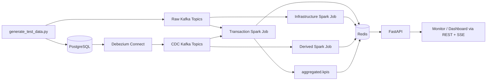
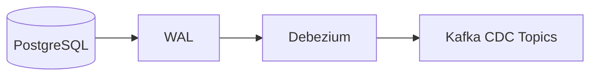
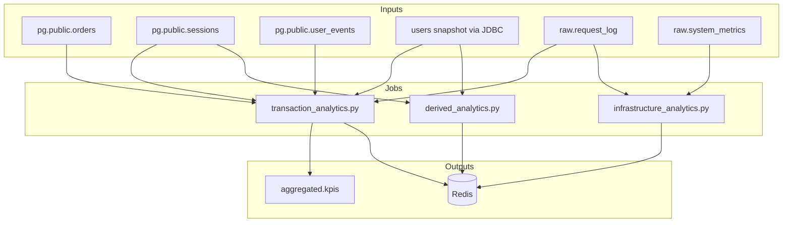
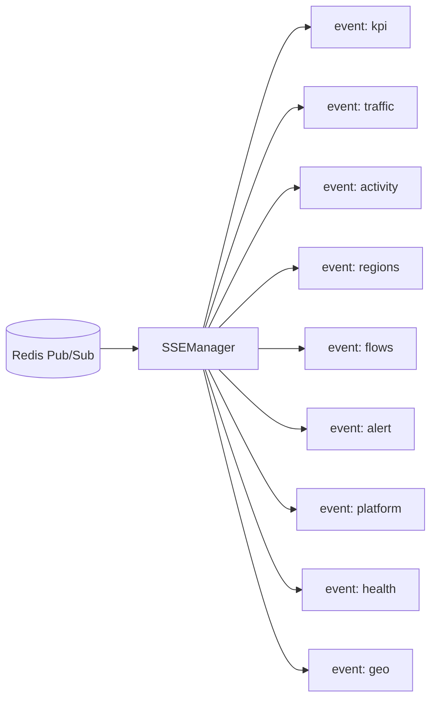
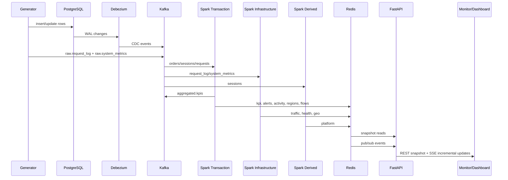

# Nexus Streaming Flow

This document describes the current streaming path implemented in this repository, from source generation and PostgreSQL CDC through Kafka, Spark jobs, Redis, and the FastAPI layer used by the dashboard and the test monitor.

It is intentionally operational:
- what emits data
- what each Spark job reads
- what each job writes
- which Redis keys and API endpoints are fed by each stage

## End-to-End Overview

## Source Layer

### Synthetic Generator

[`scripts/generate_test_data.py`](/home/anouar_zerrik1/projects/cdc-pipeline-feature-debezium-mode-worktree/scripts/generate_test_data.py) drives both ingestion paths:

- PostgreSQL writes:
  - `orders`
  - `sessions`
  - `user_events`
  - other relational source tables already present in the schema
- direct Kafka writes:
  - `raw.request_log`
  - `raw.system_metrics`

`mode=all` now runs the Postgres and Kafka generation paths concurrently.

### PostgreSQL and Debezium

Transactional and behavioral tables live in PostgreSQL. Debezium captures row changes and publishes them to Kafka CDC topics.

Primary CDC topics used by the streaming jobs:

- `pg.public.orders`
- `pg.public.sessions`
- `pg.public.user_events`
- `pg.public.products`
- `pg.public.users`

## Kafka Layer

There are two input classes:

- Direct raw topics
  - `raw.request_log`
  - `raw.system_metrics`
- Debezium CDC topics
  - `pg.public.*`

There is also one derived Kafka topic currently used as a contract output:

- `aggregated.kpis`

### Important decoding detail

[`src/streaming/kafka_sources.py`](/home/anouar_zerrik1/projects/cdc-pipeline-feature-debezium-mode-worktree/src/streaming/kafka_sources.py) strips the 5-byte Confluent Schema Registry wire header before Avro decoding CDC and raw direct messages.

Without that step, Spark receives invalid Avro payloads and downstream streams become unreliable.

## Spark Jobs

There are three Spark applications in the stack.

### 1. Transaction Job

Entry point:
- [`src/streaming/jobs/transaction_analytics.py`](/home/anouar_zerrik1/projects/cdc-pipeline-feature-debezium-mode-worktree/src/streaming/jobs/transaction_analytics.py)

Purpose:
- business KPIs
- alert state
- live activity feed
- regional snapshot
- flow snapshot

Inputs:
- `orders` CDC stream
- `sessions` CDC stream
- `products` CDC stream
- `request_log` direct Kafka stream
- `users` JDBC snapshot
- `orders` JDBC snapshot

Main transforms:

#### KPI Aggregator

File:
- [`src/streaming/transforms/kpi_aggregator.py`](/home/anouar_zerrik1/projects/cdc-pipeline-feature-debezium-mode-worktree/src/streaming/transforms/kpi_aggregator.py)

Reads:
- completed orders
- active sessions
- request logs

Computes:
- `activeUsers`
- `revenue`
- `orders`
- `errorRate`
- `latency`
- trend fields using hourly Redis snapshots

Writes:
- Redis hash `nexus:kpi:current`
- Redis hash `nexus:kpi:snapshot:{epoch_hour}`
- Pub/Sub channel `nexus.kpi`
- Kafka topic `aggregated.kpis`

Also writes alert state directly from the KPI batch:
- `nexus:alert:rules`
- `nexus:alert:summary`
- Pub/Sub channel `nexus.alerts`

#### Alert Evaluator

File:
- [`src/streaming/transforms/alert_evaluator.py`](/home/anouar_zerrik1/projects/cdc-pipeline-feature-debezium-mode-worktree/src/streaming/transforms/alert_evaluator.py)

This query still evaluates KPI windows into rule rows and maintains a fresh alert stream on the transaction side. The KPI writer also maintains alert Redis state as a pragmatic fallback so `/api/alerts` stays populated even if the evaluator is delayed.

#### Activity Enricher

File:
- [`src/streaming/transforms/activity_enricher.py`](/home/anouar_zerrik1/projects/cdc-pipeline-feature-debezium-mode-worktree/src/streaming/transforms/activity_enricher.py)

Current operational source:
- request log stream

Current purpose:
- turn live request traffic into a readable activity feed for API verification and dashboard testing

Writes:
- Redis list `nexus:activity:feed`
- Pub/Sub channel `nexus.activity`

#### Region Aggregator

File:
- [`src/streaming/transforms/region_aggregator.py`](/home/anouar_zerrik1/projects/cdc-pipeline-feature-debezium-mode-worktree/src/streaming/transforms/region_aggregator.py)

Reads:
- completed orders
- request logs

Computes:
- per-region `sales`
- per-region `intensity`

Writes:
- Redis string `nexus:regions:current`
- Pub/Sub channel `nexus.regions`

The same `foreachBatch` also derives top flows from the latest ranked regions and writes:
- Redis string `nexus:flows:current`
- Pub/Sub channel `nexus.flows`

This was collapsed into the same query to avoid a second stateful stream and to remove a broken checkpoint path that was crashing the job.

### 2. Infrastructure Job

Entry point:
- [`src/streaming/jobs/infrastructure_analytics.py`](/home/anouar_zerrik1/projects/cdc-pipeline-feature-debezium-mode-worktree/src/streaming/jobs/infrastructure_analytics.py)

Purpose:
- request throughput
- infrastructure health
- geo header summary

Inputs:
- `raw.request_log`
- `raw.system_metrics`

Transforms:

#### Traffic Builder

Writes:
- Redis list `nexus:traffic:timeseries`
- Pub/Sub channel `nexus.traffic`

#### Health Aggregator

Writes:
- Redis hash `nexus:health:current`
- Pub/Sub channel `nexus.health`

#### Geo Header Aggregator

Writes:
- Redis hash `nexus:geo:header`
- Pub/Sub channel `nexus.geo`

### 3. Derived Job

Entry point:
- [`src/streaming/jobs/derived_analytics.py`](/home/anouar_zerrik1/projects/cdc-pipeline-feature-debezium-mode-worktree/src/streaming/jobs/derived_analytics.py)

Purpose:
- device/platform breakdown

Inputs:
- `sessions` CDC stream
- `users` JDBC snapshot

Behavior:
- seeds platform breakdown immediately from the relational user snapshot
- then maintains a live streaming platform breakdown from sessions

Transform:
- [`src/streaming/transforms/device_platform.py`](/home/anouar_zerrik1/projects/cdc-pipeline-feature-debezium-mode-worktree/src/streaming/transforms/device_platform.py)

Writes:
- Redis string `nexus:platform:breakdown`
- Pub/Sub channel `nexus.platform`

## Redis Contract

The active hot-path keys consumed by the API are:

| Key | Type | Produced By |
|---|---|---|
| `nexus:kpi:current` | HASH | KPI aggregator |
| `nexus:traffic:timeseries` | LIST | Traffic builder |
| `nexus:activity:feed` | LIST | Activity enricher |
| `nexus:regions:current` | STRING(JSON) | Region aggregator |
| `nexus:flows:current` | STRING(JSON) | Region aggregator |
| `nexus:platform:breakdown` | STRING(JSON) | Device platform aggregator |
| `nexus:alert:rules` | STRING(JSON) | KPI aggregator / alert evaluator |
| `nexus:alert:summary` | HASH | KPI aggregator / alert evaluator |
| `nexus:health:current` | HASH | Health aggregator |
| `nexus:geo:header` | HASH | Geo header aggregator |

Pub/Sub channels:

- `nexus.kpi`
- `nexus.traffic`
- `nexus.activity`
- `nexus.regions`
- `nexus.flows`
- `nexus.platform`
- `nexus.alerts`
- `nexus.health`
- `nexus.geo`

## API Layer

FastAPI entry point:
- [`src/api/main.py`](/home/anouar_zerrik1/projects/cdc-pipeline-feature-debezium-mode-worktree/src/api/main.py)

Snapshot routes:
- [`src/api/routes/snapshots.py`](/home/anouar_zerrik1/projects/cdc-pipeline-feature-debezium-mode-worktree/src/api/routes/snapshots.py)

SSE route:
- [`src/api/routes/events.py`](/home/anouar_zerrik1/projects/cdc-pipeline-feature-debezium-mode-worktree/src/api/routes/events.py)

Redis reader/parsing:
- [`src/api/services/redis_service.py`](/home/anouar_zerrik1/projects/cdc-pipeline-feature-debezium-mode-worktree/src/api/services/redis_service.py)

SSE mapping:

Client-facing endpoints:

- `GET /api/metrics`
- `GET /api/traffic`
- `GET /api/activities`
- `GET /api/regions`
- `GET /api/flows`
- `GET /api/alerts`
- `GET /api/platform`
- `GET /api/health`
- `GET /api/geo`
- `GET /events`

Test UIs:

- `GET /generator`
- `GET /monitor`

## Failure Modes That Mattered

The main operational issues fixed during this alignment work were:

- Avro decode failure due to unstripped Schema Registry wire header
- missing `aggregated.kpis` publication even though downstream logic expected it
- stale/corrupt Spark checkpoints causing `StateSchemaNotCompatible` and missing delta-file failures
- alert summary timestamp parsing mismatch in the API
- separate region/flow stateful queries making the transaction job more fragile than necessary

## Practical Runtime Summary

